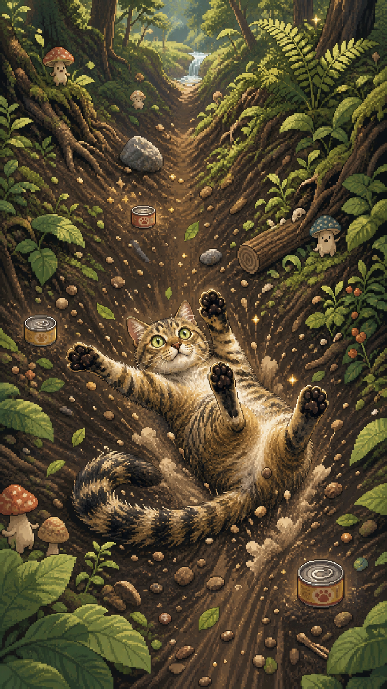

# Neko Rogaru

A visual and product-design kit for a cute portrait browser game inspired by the famous four-paws-up sliding cat pose.

The player steers a tabby through an endless sequence of forests, rivers, shrine paths, seasons, weather, collectibles, curiosities, and safe comic mishaps. Each run ends with an exportable ten-second vertical replay designed for sharing.

## What is included

- Five 9:16 scrolling environments
- 154 individually sliced pixel-art sprites
- Character, prop, environment, UI, season/weather, and ending atlases
- Transparent social-video replay frame
- Machine-readable asset manifest
- Complete game requirements and browser video-export specification
- Static visual preview page

## Start here

- [`asset-preview.html`](asset-preview.html) — visual asset board
- [`GAME-REQUIREMENTS.md`](GAME-REQUIREMENTS.md) — consolidated product specification
- [`VIDEO-EXPORT-SPEC.md`](VIDEO-EXPORT-SPEC.md) — ten-second Canvas replay architecture
- [`ASSET-GUIDE.md`](ASSET-GUIDE.md) — art direction and discovery system
- [`assets/generated/manifest.json`](assets/generated/manifest.json) — asset paths and sprite IDs
- [`GENERATION-PROMPTS.md`](GENERATION-PROMPTS.md) — image-generation specifications

## Repository status

This repository currently contains the complete visual/content foundation. The gameplay engine is intentionally not implemented yet.

## Asset utilities

Run `scripts/slice_atlases.py` with Python and Pillow to regenerate individual sprites from the transparent atlases.

## Publishing note

The generated game art is original, but the central character intentionally references a recognizable real cat and meme photograph. Confirm the necessary rights for the underlying likeness/photo association before a commercial release.
